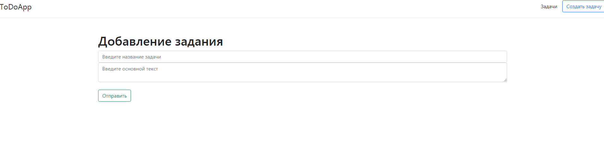
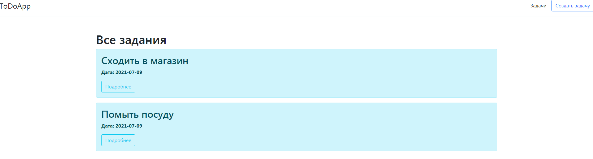
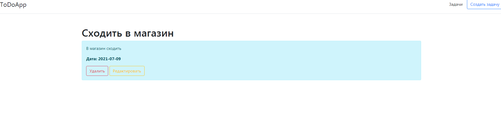

# Flask Todo App
## Обзор
Todo app - простое приложение для изучения микро-инфраструктуры веб-разработки Python, разработанное с помощью `Flask`, `SQLAlchemy` и `Bootstarp` и развернут на Heroku.

Приложение следует операциям CRUD (create, read, update, delete)
## Скриншоты



##Технические моменты
Приложение написано на языке Python3
- `app.py` используется для запуска приложения и является его движком. В нем же проводятся все операции с базой данных.
- папка **templates** содержит 5 файлов `base.html`, `create_article.html`, `posts. html`, `post_patch.html`, `posts_detail.html`, описывающие структуру приложения. Эти файлы связаны с Python через фреймворк Flask.
## Установка и запуск
Код написан на Python 3.8.5. Если у вас не установлен Python, вы можете найти его [здесь](https://www.python.org/downloads/). 
Если вы используете более раннюю версию Python, вы можете выполнить обновление с помощью пакета pip, убедившись, что у вас установлена последняя версия pip.
Чтобы установить необходимые пакеты и библиотеки, запустите эту команду в каталоге проекта после клонирования репозитория:
````
pip install -r requirements.txt 
````
Клонировать репозиторий:
````
git clone https://github.com/
````
Чтобы запустить приложение достаточно прописать команду:
````
python app.py
````
